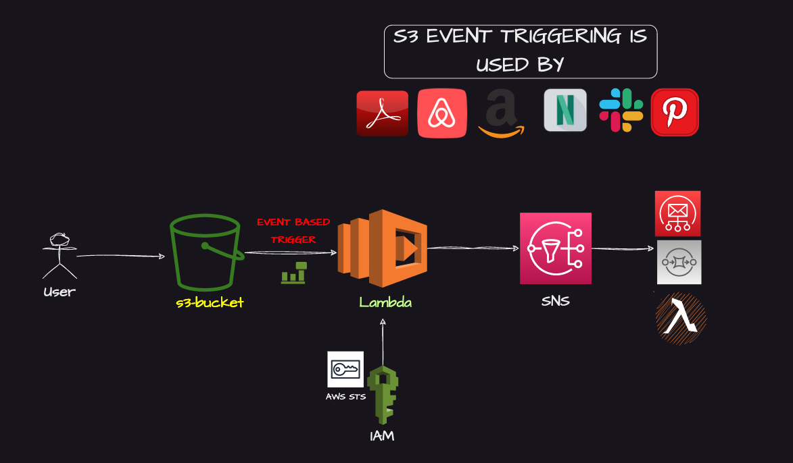
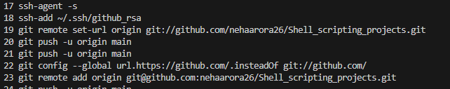
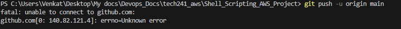

# AWS S3 Event Triggering

AWS S3 Event triggering is a very popular project used by top companies in the Industry.

Here are some examples of top companies that use S3 event triggering:

    Netflix: Netflix use S3 event triggering to automatically process video files uploaded to Amazon S3, enabling seamless content ingestion and processing.

    Airbnb: This lodging and homestays aggregator use S3 event triggering to automatically process and analyze data stored in Amazon S3, such as guest reviews and booking information.

    Expedia: They use S3 event triggering to automatically process and analyze data stored in Amazon S3, such as travel bookings, user profiles, and pricing information, to power their personalized travel recommendations and search features.

## Troubleshooting:

1. I had trouble accessing my GitHub repos from my VS Code editor.
So I used these commands:

2. For errors like this:

This error occurred because my git port is restricted.
So, I fixed it with the following command:

    git config --global url.https://github.com/.insteadOf git://github.com/

