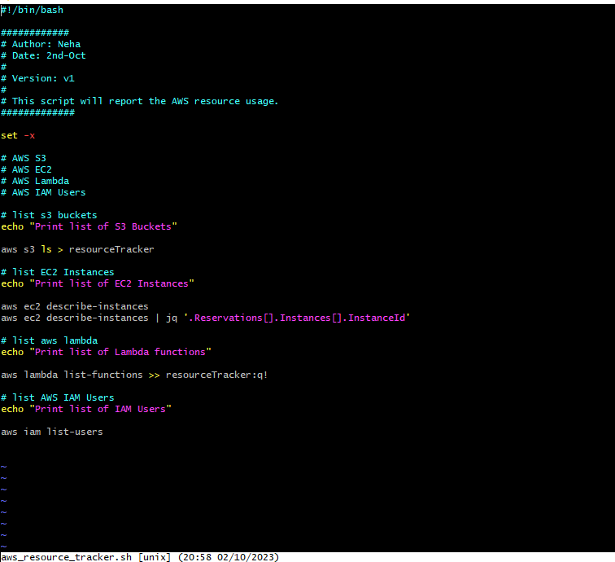

Go to git Bash and check if your AWS CLI is installed by typing
    
    aws 

To configure your credentials to communicate with AWS, use
    
    aws configure

You'll need to enter your aceess code and secret access code.

# AWS CLI Reference has all the commands for any of the aws services.

The AWS Command Line Interface is a unified tool that provides a consistent interface for interacting with all parts of AWS.

https://docs.aws.amazon.com/cli/latest/

## The script looks like this.

## Output looks like this

## You can also redirect the output to a separate file/folder

